# ComputerMart
Summary : It is a web development project using ASP.NET MVC . This our 3rd year 2nd semester project. This is basically an online tech gadget store where any tech gadget can be found . people can buy their necessary gadget. There is an admin who manages the orders .  

## Software Specification 
* Language : C# , ASP.NET MVC 
* Database : MS SQL Server 2019
* IDE : Visual Studio 2022

## Features:
* User Login and Registration System with SQL server 
* Home page
* User can search product
* User can buy their product
* Add to cart option
* Admin section 
* Admin can add category and product
* Admin manages the orders

## Project Demo : 
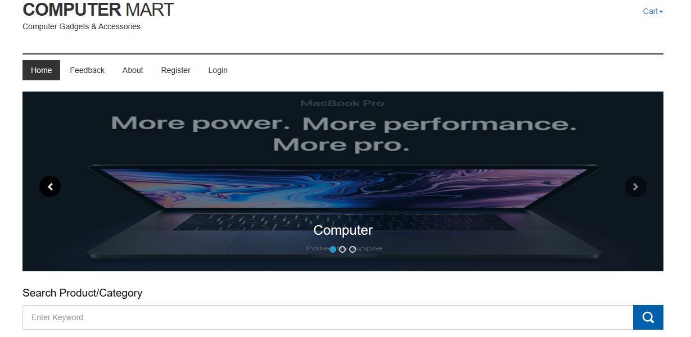 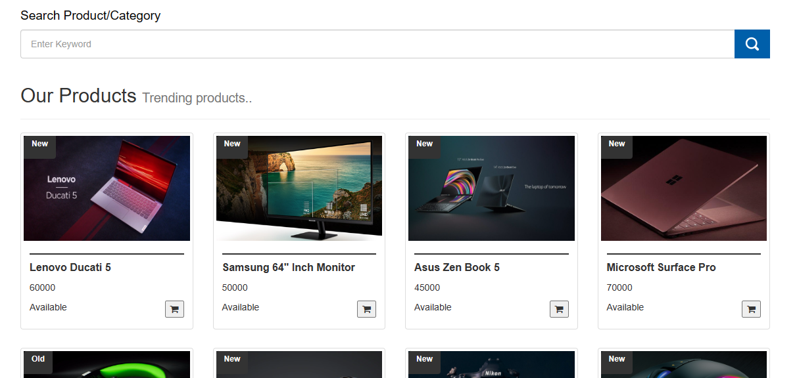

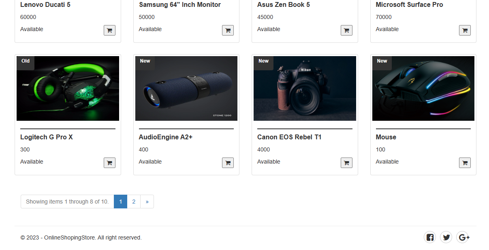 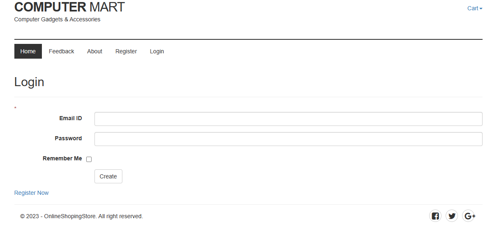

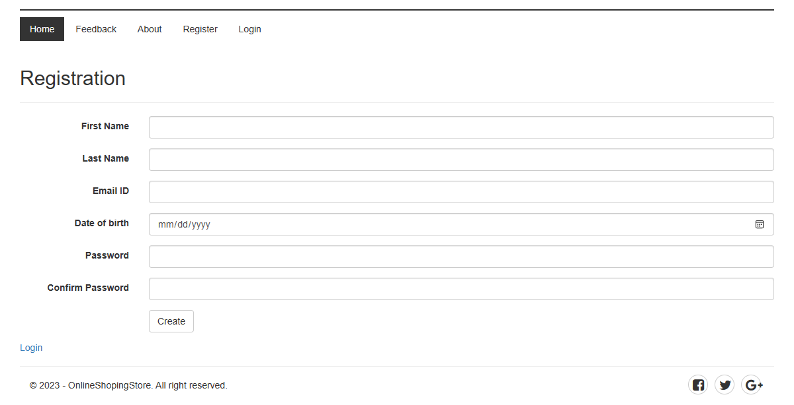 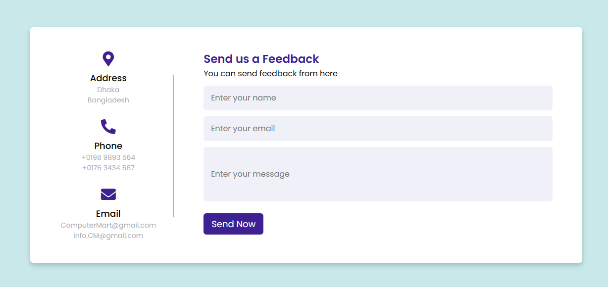

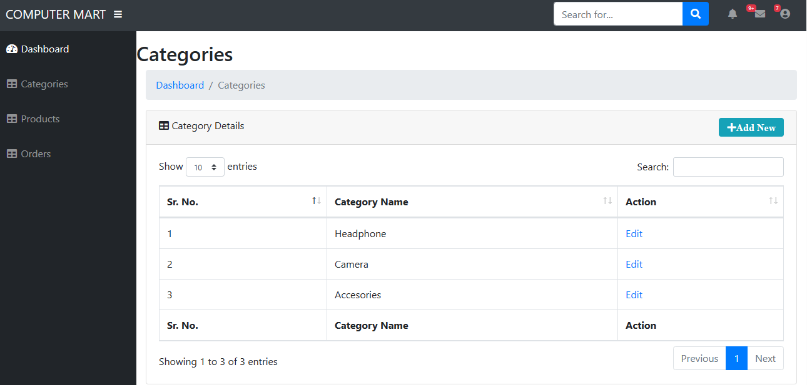 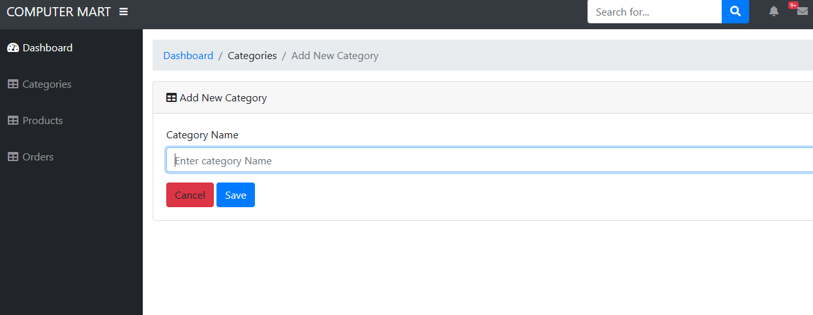

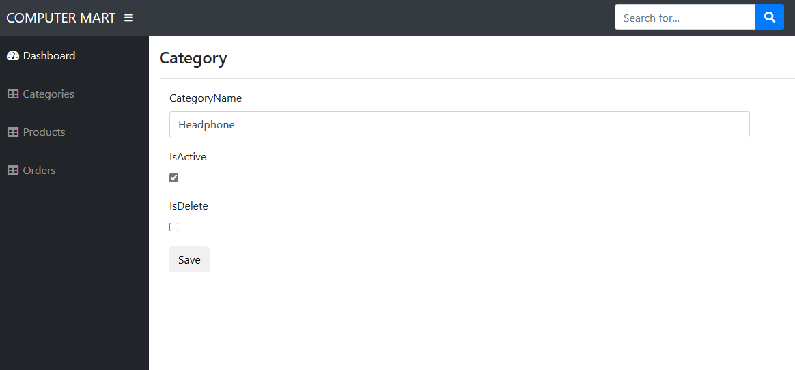 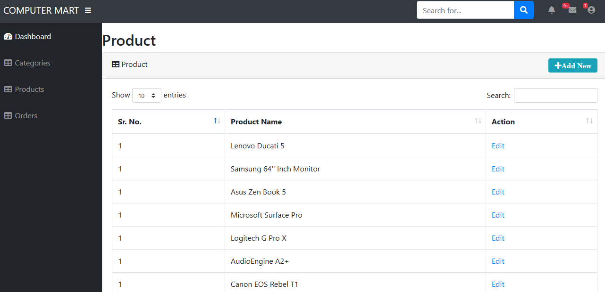

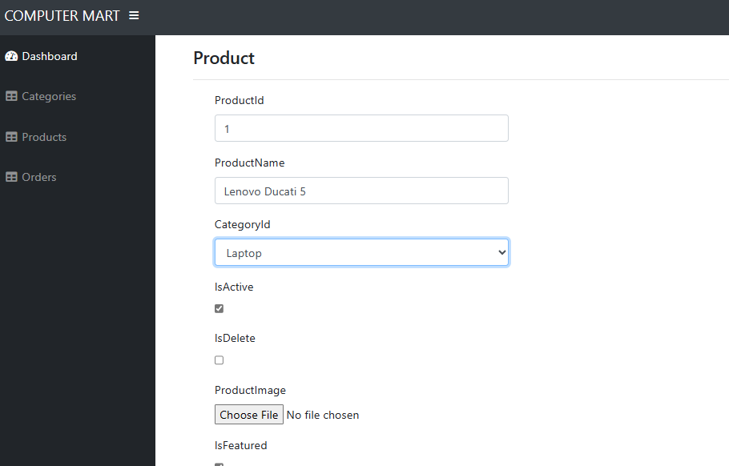 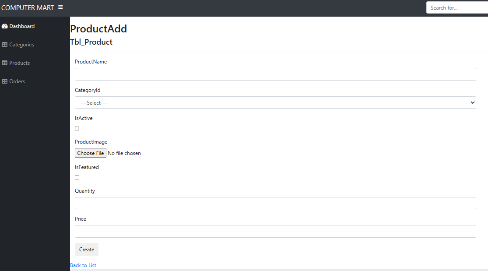

 
